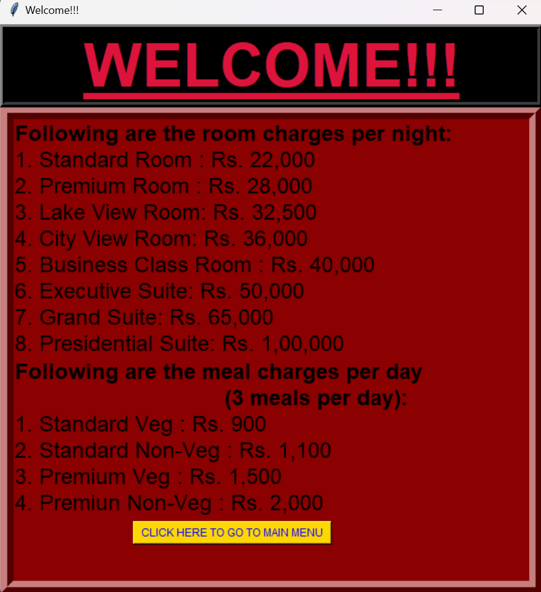

# EliteHospitality Hub - Hotel Management Software

## Overview

EliteHospitality Hub is a premium hotel management software built in Python, leveraging Object-Oriented Programming (OOPs) concepts. This software utilizes various Python packages and connects to a MySQL database using `mysql-connector`. It provides a comprehensive solution for managing guests, room details, and generating billing receipts.

## Features

- **Welcome Screen:**
  The software opens with a welcome screen displaying per night charges for different room types, emphasizing the premium nature of the hotel.

- **Meal Options:**
  Users can select the type of meals they want to be served during their stay.

- **Main Menu:**
  The main menu is the central hub with various functions, including adding, updating, and deleting guest details.

- **Guest List:**
  On the right side of the main menu, users can view the guest list and search for guests using room numbers or names.

- **Detailed Guest View:**
  Clicking on a guest in the list populates the left side with guest details. Users can generate the bill receipt from this screen.

- **Billing Receipt:**
  The software provides the functionality to generate a detailed bill receipt, offering a final summary of charges.

## Screenshots





## Technologies Used

- **Language:** Python
- **Database:** MySQL

## Getting Started

1. **Clone the Repository:**
   ```bash
   git clone https://github.com/rishabh129/EliteHospitalityHub.git

2. **Install Dependencies**:
    ```bash
   pip install -r requirements.txt

3. **Database Setup**:
  - Create a MySQL database and import the provided schema.
  - Configure the database connection in config.py.

4. **Run the Application**:
     ```bash
   python main.py

## Usage

- Launch the application and navigate through the welcome screen and main menu.
- Add, update, and delete guest details.
- Generate billing receipts for guests.

## Contributing

- Contributions are welcome! If you find any bugs or have suggestions for improvement, please open an issue or submit a pull request.

## Acknowledgments

- Thanks to contributors who have contributed to this project.
- Special thanks to the Python and MySQL communities.
